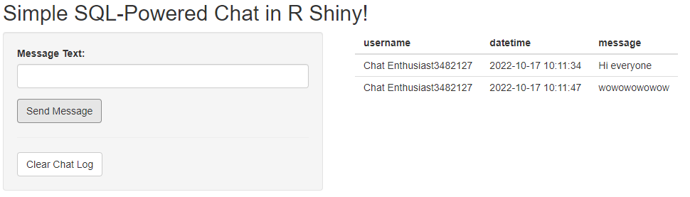
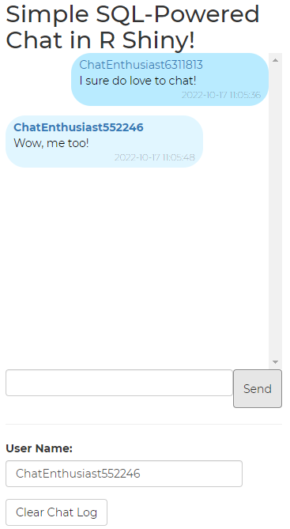

<!-- README.md is generated from README.Rmd. Please edit that file -->

# A simple chat application using R Shiny

This demo shows how to build a basic chat application in R using Shiny
and SQLite. It’s a bit of a silly project but the underlying logic can
also be used for serious business applications, and we’ll use databases,
html, CSS, a bit of Javascript, and a lot of R.

You can try out [**a completely unmoderated (!! please be respectful !!)
version here**](https://chris31415926535.shinyapps.io/shiny-sql-chat/),
which will remain up for an indeterminate amount of time.

To try out the finished product yourself, [grab the code from
GitHub](https://github.com/chris31415926535/shiny.sql.chat), load app.R
in RStudio, and click “Run App.”

The basic logic is:

-   Messages are stored in a database. We’ll use SQLite, because it’s
    easy, local, and file-based, but in a real project you might use a
    cloud-based SQL (or noSQL) server.
-   When a user sends a message, it’s added to the database as a new
    row.
-   Once per second, the app checks the database to see if there are new
    messages, and if it finds any it downloads them.
-   Messages are formatted using CSS based on whether the current
    username matches the message sender’s name.
-   A bit of extra JavaScript adds polish by auto-scrolling down when a
    new message is received.

This post was inspired by [this older
post](https://www.r-bloggers.com/2017/07/shiny-chat-in-few-lines-of-code-2/),
but extends it quite a bit and brings it up to date.

# Step 1: Set up the database

First, we need to set up the database we’ll use to store our chat
messages. We’ll use [SQLite](https://www.sqlite.org/), describe by its
authors as “a small, fast, self-contained, high-reliability,
full-featured, SQL database engine.” It also has [first-class support
from RStudio](https://solutions.rstudio.com/db/databases/sqlite/)
through the [RSQLite package](https://github.com/r-dbi/RSQLite).

SQLite databases exist as regular files, so we’ll name ours
`messages.sqlite` and keep it in a folder called `data`. Databases can
contain many tables, so we’ll store our messages in a table named
`messages`.

Then, to initialize our database, we’ll create a zero-row tibble to use
as a template that we can add rows to later. To keep it simple, we’ll
store each message’s username, date and time, and message, all as
characters.

``` r
library(dplyr)
library(DBI)
library(RSQLite)

# create a zero-row tibble with the correct column names and data types
message_db_schema <- dplyr::tibble(username = character(0),
                                   datetime = character(0),
                                   message = character(0))

# make sure we have a data directory
if (!dir.exists("data")) dir.create("data")

# connect to SQLite database, or create one
con <- DBI::dbConnect(RSQLite::SQLite(), "data/messages.sqlite")

# if there is no message table, create one using our schema
if (!"messages" %in% DBI::dbListTables(con)){
  dplyr::copy_to(con, message_db_schema, name = "messages", overwrite = TRUE,  temporary = FALSE )
}
```

Now we have a connection object named `con` that points to our database.

To add a new message, we put our data in a one-row tibble and use
`DBI::dbAppendTable()` to add it:

``` r
new_message <- dplyr::tibble(
  username = "Chris",
  datetime = Sys.time(),
  message = "Hi everyone!"
)

RSQLite::dbAppendTable(con, "messages", new_message)
```

And to read our message, we use `dplyr::tbl()` to get a connection to
the `messages` table, and then call `collect()` to download the results.

``` r
chat_messages <- dplyr::tbl(con, "messages") %>%
  collect()
```

Until we call `collect()`, we’re actually operating on data that’s *in
the database*, not stored in memory. We’re not taking advantage of here,
but databases give the ability to do a lot of `dplyr`-esque operations
*remotely* and then to call `collect()` to download the results once
they’re processed.

This is really the entirety of the database stuff, and if you had a few
friends running R on the same machine you could technically use this to
chat with each other.

But, as is so often the case, putting this simple logic into a Shiny app
makes it much more impressive!

# Step 2: Make it Shiny

Let’s set up the UI for our basic Shiny app. We’ll use a
`sidebarLayout()` structure with chat controls on the left, and chat
messages on the right. We need two inputs: a text field for message
text, and a button to send messages. For convenience we’ll also add a
second button to clear the chat logs.

I’ll present the highlights here, and [you can see the whole thing in
the file app-basic.R on GitHub
here](https://github.com/chris31415926535/shiny.sql.chat).

Our entire UI code fits into just a few lines:

``` r
# Define UI for basic chat application
ui <- fluidPage(
  
  # Application title
  titlePanel("Simple SQL-Powered Chat in R Shiny!"),
  
  # Sidebar with user input and chat controls
  sidebarLayout(
    sidebarPanel(width = 3,
                 textInput("msg_text", "Message Text:"),
                 actionButton("msg_button", "Send Message"),
                 hr(),
                 actionButton("msg_clearchat", "Clear Chat Log")),
    
    # main chat panel
    mainPanel(tableOutput("messages_basic")))
)
```

Next, we define our server logic. To keep it simple we’ll assign users
random names à la [Firstname
Bunchofnumbers](https://knowyourmeme.com/memes/firstname-bunchofnumbers)[1],
and assume we’ll set up a connection `con` to our database as described
above.

Then we need:

-   A button handler for when people click “Send Message”;
-   A button handler for when people click “Clear Chat Log”;
-   A way to regularly check for new messages; and,
-   An output that displays new messages as they’re received.

To make this all work, we’re going to store the current set of messages
locally in a `reactiveValues` object. This way our outputs will update
automatically if we get new messages. We’ll also put the code to read
messages into a function since we need to do it in a few different
places:

``` r
# A separate function in case you want to do any data preparation (e.g. time zone stuff)
read_messages <- function(con){
  dplyr::tbl(con, "messages") %>%
    collect()
}

# read initial set of messages
messages_db <- reactiveValues(messages = read_messages(con))
```

The button handler for sending a message is straightforward but long.
*If* there is a valid message to send, then create a one-row tibble with
the username/date-time/message, append it to the table `messages` in the
database, read the new values from the database, and empty the
message-text input area.

``` r
# Button handler for sending a message
observeEvent(input$msg_button, {
  
  # only do anything if there's a message
  if (!(input$msg_text == "" | is.null(input$msg_text))) {
    
    msg_time <- Sys.time() %>%
      as.character()
    
    new_message <- dplyr::tibble(username = msg_username,
                                 message = input$msg_text,
                                 datetime = msg_time)
    
    RSQLite::dbAppendTable(con, "messages", new_message)
    
    messages_db$messages <- read_messages(con)
    
    # clear the message text
    shiny::updateTextInput(inputId = "msg_text",
                           value = "")
  }
})
```

The button handler for clearing the chat is even simpler: just overwrite
the `messages` table in the database with our empty schema:

``` r
# Button handler for clearing the chat
observeEvent(input$msg_clearchat, {
  dplyr::copy_to(con, message_db_schema, name = "messages", overwrite = TRUE,  temporary = FALSE )
  messages_db <- reactiveValues(messages = read_messages(con))
})
```

The last major piece is to regularly poll the database for new messages.
Here we’ll use a `reactiveTimer()` that fires once ever 1000
milliseconds and checks the database.

``` r
  # create a reactive timer to check the database regularly
  db_check_timer <- shiny::reactiveTimer(intervalMs = 1000)

  # check the table for updates each second
  observe({
    db_check_timer()
    messages_db$messages <- read_messages(con)
  })
```

And, for completeness, we have a simple `renderTable()` to render our
output.

``` r
# Display our messages using a basic table output
output$messages_basic <- shiny::renderTable(messages_db$messages)
```

If we put this all together, we get a functional chat app!



It may not be pretty, but it *works!* If you run the app and load it in
two different browser tabs, you’ll see messages from one appear in the
other a second later.

[See the full code
here!](https://github.com/chris31415926535/shiny.sql.chat/blob/main/app-basic.R)

# Step 3: Polish it with CSS and Javascript

Now that we have our basic app, let’s make it fancy by reorganizing our
UI, styling it with CSS, and adding some Javascript. I’m just going to
hit the highlights here, but you can see the whole app [here on
GitHub](https://github.com/chris31415926535/shiny.sql.chat/blob/main/app.R).

## Reorganizing the UI

Instead of using a `sidebarLayout()`, let’s put the chat messages in a
window over the input controls like a normal chat app. Also, instead of
printing our chat messages as a boring table, let’s output it as html
that we can then style with CSS.

The actual layout code for our UI looks very similar, except it now has
no `sidebayLayout()` wrapper, a new line `id = "chatbox-container"`, and
some stuff about `style="display:flex"`.

``` r
ui <- fluidPage(
  id = "chatbox-container",

  # Application title
  titlePanel("Simple SQL-Powered Chat in R Shiny!"),

  uiOutput("messages_fancy"),

  tags$div(textInput("msg_text", label = NULL),
           actionButton("msg_button", "Send", height="30px"),
           style="display:flex"),
  hr(),
  textInput("msg_username", "User Name:", value = "Chat Enthusiast"),
  actionButton("msg_clearchat", "Clear Chat Log")
)
```

But *also* notice that now we’re using `uiOutput()` instead of
`tableOutput()`. `uiOutput()` lets us render HTML in our server and have
it display and update dynamically.

This dynamic rendering happens in the function `render_msg_fancy()`,
inspired by [this blog
post](https://www.r-bloggers.com/2017/07/shiny-chat-in-few-lines-of-code-2/):

``` r
render_msg_fancy <- function(messages, self_username) {
  div(id = "chat-container",
      class = "chat-container",
      messages %>%
        purrrlyr::by_row(~ div(class =  dplyr::if_else(
          .$username == self_username,
          "chat-message-left", "chat-message-right"),
          a(class = "username", .$username),
          div(class = "message", .$message),
          div(class = "datetime", .$datetime)
        ))
      %>% {.$.out}
  )
}
```

`render_msg_fancy()` takes each row of our message table and transforms
it into html divs with specific classes and ids that we can then style
with css. Note there’s a `dplyr::if_else()` in there that checks to see
if the current username is the same as the message sender’s username,
and assigns the message a class `chat-message-left` or
`chat-message-right` accordingly.

To make it concrete, here’s what `render_msg_fancy()` outputs for a
one-row chat log:

``` hmtl
<div id="chat-container" class="chat-container">
  <div class="chat-message-right">
    <a class="username">Chat Enthusiast5917836</a>
    <div class="message">I sure do love to chat!</div>
    <div class="datetime">2022-10-17 10:19:24</div>
  </div>
</div>
```

## Styling with CSS

We’ll use custom CSS to format messages nicely, and *differently*
depending on whether they were sent by the current user or another user.
CSS is tricky (for me) and beyond the scope of Shiny *per se*, but the
key here is that we gave our message html divs either the class
`chat-message-left` or `chat-message-right` based on who sent them. Then
we can use CSS to make them distinct:

``` css
.chat-container .chat-message-left {
  // format messages from the current user one way
}

.chat-container .chat-message-right {
  // format messages from other users differently
}
```

I then put the CSS into a separate file in the folder `www` and added
this code up top in my UI to include it:

``` r
  tags$head(tags$link(rel = "stylesheet", type = "text/css", href = "styling.css"))
```

[Take a look at the full CSS file
here](https://github.com/chris31415926535/shiny.sql.chat/blob/main/www/styling.css).

## Adding some Javascript

Finally, we’ll add two little Javascript functions to let users send a
message by pressing enter, and to auto-scroll to the bottom when a new
message is received. [I nicked both of these from
Appsilon](https://github.com/Appsilon/shiny.collections/blob/master/inst/examples/www/script.js).

For the enter-send, we use a small jQuery function that monitors our
text input for the key “enter,” and upon detection simulates a click on
our message button. In both cases we use html ids `#msg_text` and
`#msg_buttons` that correspond to our objects’ internal `inputId`s in
our server code.

``` javascript
jQuery(document).ready(function(){
  jQuery('#msg_text').keypress(function(evt){
    if (evt.keyCode == 13){
      // Enter, simulate clicking send
      jQuery('#msg_button').click();
    }
  });
})
```

Finally, with our last Javascript code we monitor the element
`chat-container` for new elements, and scroll to the bottom if we detect
one.

# The result!

Putting it all together, we now have a fancy chat application

<figure>
<figcaption aria-hidden="true">A fancy chat application written in R with Shiny!</figcaption>
</figure>

You can try out [**a completely unmoderated (!! please be respectful !!)
version here**](https://chris31415926535.shinyapps.io/shiny-sql-chat/),
which will remain up for an indeterminate amount of time.

# Step 4: Next steps?

A chat app is fun, but at the core we’ve built an engine for
*centralized multi-user message exchanges*, and the same logic could be
applied to cases with real-world value. For example:

-   Enabling real-time communication and collaboration between
    concurrent users in a Shiny analytics app;
-   Enabling users to complete and submit applications, which could be
    reviewed and processed by users with administrative privileges, and
    sending the results back to applicants; or,
-   Enabling multi-user discrete-time simulations where commands are
    sent to a central server for processing, and results are sent back
    to users.

As always, reach out if you have any questions or if you’d like to talk
about how R and Shiny can help you achieve your goals.

[1] `msg_username <- paste0("ChatEnthusiast", round(runif(n=1, min=10^6,max = 10^7)))`
